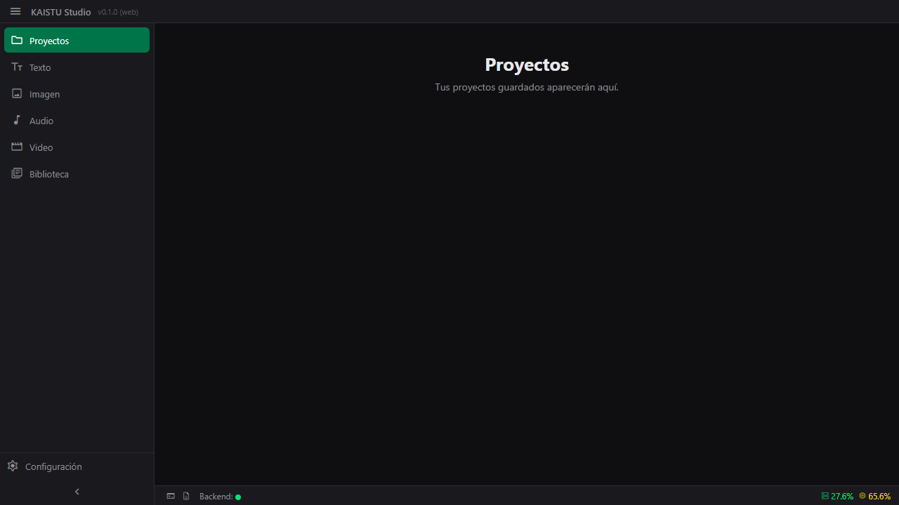
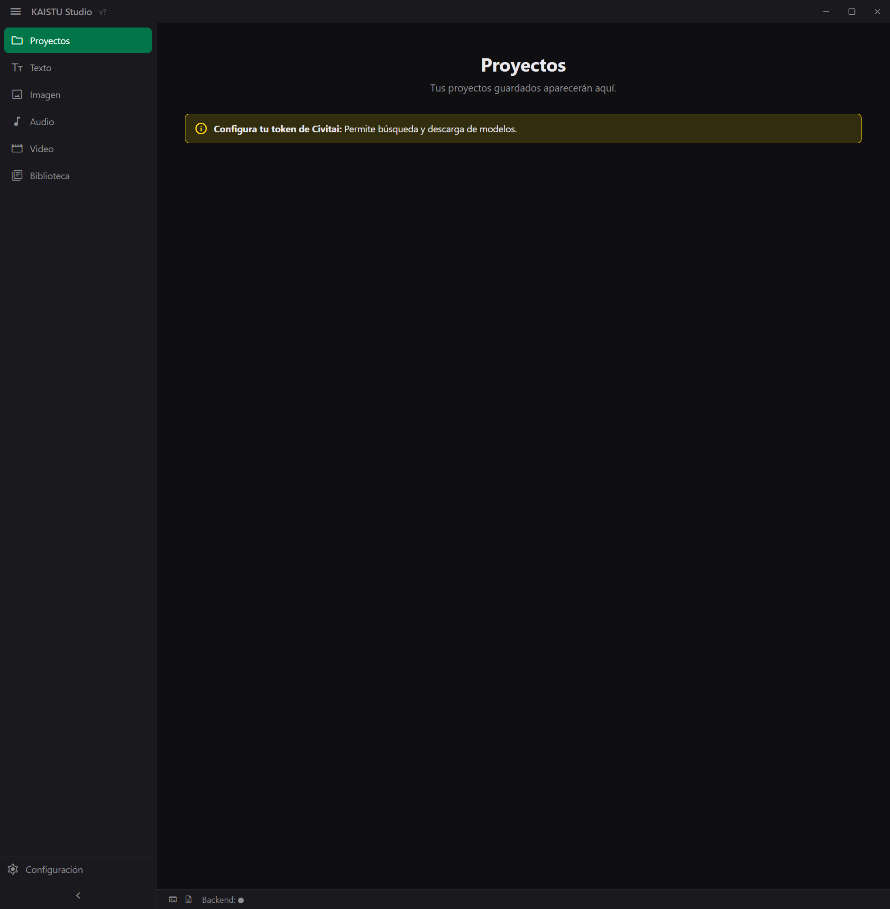
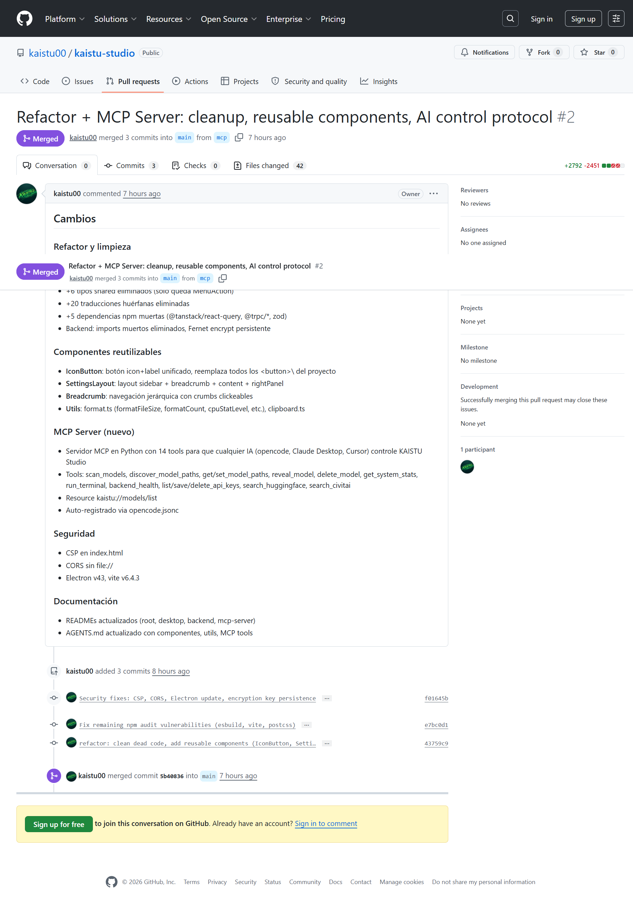

# KAISTU Studio

> AI-powered image/video processing and generation platform.

**Status:** Early development · **Version:** 0.1.0

## Features

| Feature | Description |
|---------|-------------|
| **Upscale** | Increase image/video resolution using Real-ESRGAN models (2x–4x) |
| **Clean** | AI-powered noise/artifact removal (4x upscale + 0.25x downscale) |
| **Downscale** | Reduce image/video resolution to target size |
| **Rescale** | Set exact target width/height for image/video |
| **Face Enhancement** | Optional face restoration alongside upscale/clean pipelines |
| **Model Library** | Scan, browse, search, and manage AI models (HF + Civitai) |
| **Executions** | Track, monitor, and cancel processing tasks |
| **API Keys** | Securely store Fernet-encrypted keys for Civitai, etc. |
| **System Stats** | Real-time CPU/RAM/GPU monitoring |

## Screenshots

| Home | Upscale |
|------|---------|
|  |  |

| Full App |
|----------|
|  |

## Packages

| Package | Description | Docs |
|---------|-------------|------|
| `apps/desktop` | Electron v43 + React 19 desktop client | [📖 README](./apps/desktop/README.md) |
| `apps/web` | Next.js 15 web client (placeholder) | — |
| `backend/` | Python 3.14+ FastAPI + SQLAlchemy + SQLite (33 endpoints) | [📖 README](./backend/README.md) |
| `mcp-server/` | MCP server for AI control (opencode, Claude, Cursor) — 28 tools | [📖 README](./mcp-server/README.md) |
| `packages/shared` | Shared TypeScript types (`MenuAction`) | [📖 README](./packages/shared/README.md) |

## Quick start

```bash
# Backend (terminal 1)
cd backend
py -m venv .venv && .venv\Scripts\activate
pip install -r requirements.txt
py -m uvicorn app.main:app --reload --port 8000

# Desktop (terminal 2)
npm install
npm run dev:desktop
```

The desktop app auto-detects GPU and upgrades PyTorch on first launch (CPU → CUDA/ROCm if applicable). Upscaler models download automatically when selected.

## Scripts

| Command | Description |
|---------|-------------|
| `npm run dev:desktop` | Start desktop app (Vite + Electron HMR) |
| `npm run dev:backend` | Start Python backend |
| `npm run dev` | Start both |
| `npm run build` | Build desktop for distribution |
| `npm run typecheck` | TypeScript check (desktop + shared) |
| `npm run test` | Run all tests (Vitest) |

## Architecture

```
Renderer (React) ─── IPC (contextBridge) ───> Main Process ─── HTTP ───> Python FastAPI
                                                                                │
                                                                     ┌──────────┼──────────┐
                                                                  SQLite (DB)  config.json  model-paths.json
```

- **Renderer:** React 19 SPA with Vite HMR, dark theme, i18n (ES/EN)
- **Main process:** Electron node process, 48 IPC handlers, native menus, system stats, model scanning, upscaler execution
- **Preload:** `contextBridge` exposing `window.electronAPI` (no `nodeIntegration`)
- **Backend:** FastAPI with SQLAlchemy + SQLite, CORS, Fernet-encrypted API keys
- **MCP Server:** 28 tools + 1 resource, delegates to backend or calls HF/Civitai APIs directly

## Views (Desktop)

| View | Component | Description |
|------|-----------|-------------|
| Home | `HomeView` | Landing page with quick action cards |
| Scale Selection | `ScaleSelectionView` | Choose upscale / downscale / rescale / clean |
| Upscale | `UpscaleImageView` / `UpscaleVideoView` | Upload image/video, pick model, scale factor, run |
| Downscale | `DownscaleImageView` / `DownscaleVideoView` | Downscale with target resolution |
| Rescale | `RescaleImageView` / `RescaleVideoView` | Exact width/height rescaling |
| Clean | `CleanImageView` / `CleanVideoView` | AI denoising with face enhancement option |
| Executions | `ExecutionsView` / `ExecutionDetailView` | Task history, progress, cancel |
| Library | `LibraryView` | Model browser with HF + Civitai detail panel |
| Settings | `SettingsView` | Language, model paths, appearance, API keys, about |
| Text | `TextView` | HuggingFace text model recommendations |
| Terminal | `TerminalView` | Shell terminal |
| Logs | `LogsView` | Application log viewer |

## Components (Desktop)

| Component | Description |
|-----------|-------------|
| `TitleBar` | Frameless title bar: hamburger menu, system stats (CPU/RAM/GPU), window controls |
| `Sidebar` | Collapsible navigation (52/220px) across views |
| `IconButton` | Unified icon+label button, replaces all raw `<button>` usage |
| `SettingsLayout` | Reusable layout: sidebar tabs + breadcrumb + content + optional right panel |
| `Breadcrumb` | Hierarchical navigation with clickable crumbs |
| `CompareSlider` | Before/after image comparison slider |
| `ImageDropzone` / `VideoDropzone` | File upload dropzones |
| `BottomPanel` | Resizable bottom panel (Terminal/Logs tabs) |
| `WebRootMenu` | Menu overlay triggered by hamburger button |
| `ErrorBoundary` | Error boundary with retry button |

## MCP Server

KAISTU Studio ships with a Python [MCP](https://modelcontextprotocol.io) server — **28 tools + 1 resource** — that lets any MCP-compatible AI assistant control the application:

```
opencode / Claude Desktop / Cursor ── MCP (stdio) ──> mcp-server/ (28 tools)
  ├── models:     scan, discover, get/set paths, reveal, delete
  ├── system:     stats, capabilities, run terminal
  ├── backend:    health, config, api keys
  ├── upscalers:  list, install, run (upscale/clean/downscale/rescale)
  ├── executions: list, get, cancel
  ├── huggingface: search, leaderboard, recommended, space info, run space
  ├── civitai:    search
  └── generation: generate (placeholder)
```

**`opencode.jsonc`** already registers the MCP server — it starts automatically when opencode launches.

## Conventions

- TypeScript strict mode (`noUncheckedIndexedAccess`, `exactOptionalPropertyTypes`)
- Native OS menus — no React menu bar
- Dark theme via CSS custom properties
- i18n via React context (`LangProvider` + `useT()` hook)
- User preferences in `localStorage`
- Material Symbols self-hosted (no CDN)
- All buttons use `IconButton` component
